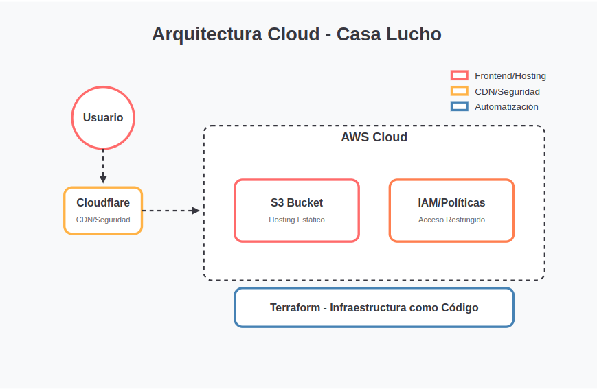
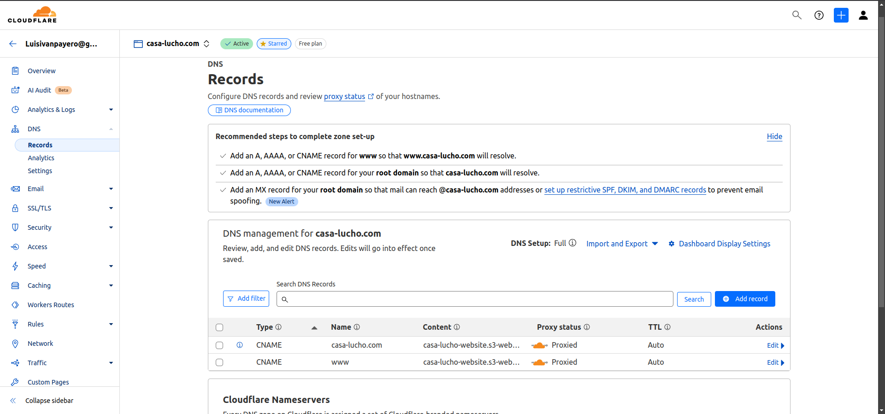
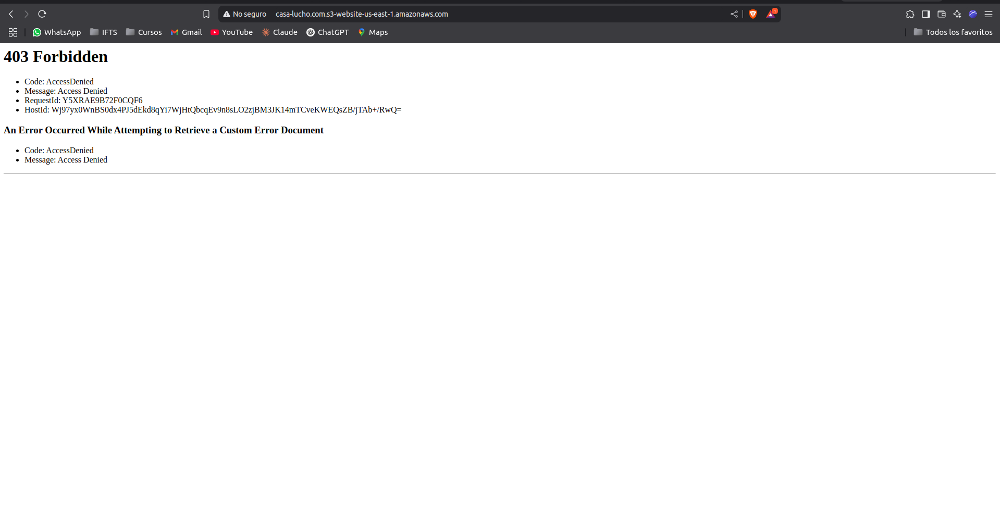
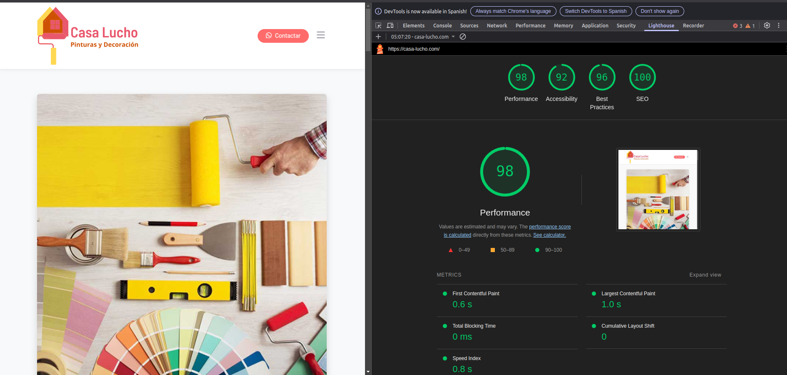

# Casa Lucho - Sitio Web con Arquitectura Serverless

Un sitio web profesional para Casa Lucho, negocio de pinturas y decoración con más de 30 años de experiencia, implementado con una arquitectura serverless de alto rendimiento y bajo costo utilizando AWS S3 y Cloudflare.



## 📋 Descripción del Proyecto

Este proyecto implementa un sitio web estático para Casa Lucho, un negocio familiar de pintura y decoración con más de 30 años de trayectoria. La solución desarrollada combina:

- Diseño web profesional y responsive
- Arquitectura cloud serverless de alta disponibilidad
- Costos operativos mínimos (~$1/mes)
- Seguridad reforzada mediante políticas de acceso

El proyecto tiene un significado personal: crear una presencia online profesional para el negocio de pintura de mi padre, aplicando mis conocimientos en cloud y desarrollo web para devolverle un poco de lo que me ayudó durante mis estudios.


## 🌐 Demo del sitio

[](https://youtu.be/6IraeOZHjZs)


## 🏗️ Arquitectura e Infraestructura

La arquitectura implementada busca maximizar rendimiento, seguridad y minimizar costos:

### Tecnologías Utilizadas:

- **AWS S3**: Alojamiento del sitio web estático
- **Cloudflare**: CDN, SSL/TLS y capa de seguridad
- **Terraform**: Infraestructura como código para automatizar despliegues
- **Bootstrap**: Framework frontend para diseño responsive

### Flujo de Acceso:

1. El usuario solicita la página web
2. Cloudflare intercepta la solicitud, proporciona SSL y sirve contenido cacheado cuando es posible
3. Si se necesita contenido fresco, Cloudflare solicita los archivos a S3
4. AWS S3 valida que la solicitud proviene de Cloudflare (restricción por IP)
5. El contenido se entrega al usuario con alta velocidad

### Seguridad:

- Acceso al bucket S3 limitado exclusivamente a IPs de Cloudflare
- Certificado SSL/TLS gestionado por Cloudflare
- Protección DDoS incluida con Cloudflare
- Sin servidores que mantener o actualizar (arquitectura serverless)

## 🚀 Implementación con Terraform

```terraform
provider "aws" {
  region  = "us-east-1"
  profile = "casa-lucho"
}

# S3 bucket para hosting del sitio web
resource "aws_s3_bucket" "website" {
  bucket = "casa-lucho"
  tags = {
    Name = "Casa Lucho Website"
  }
}

# Configuración de acceso público
resource "aws_s3_bucket_public_access_block" "website" {
  bucket                  = aws_s3_bucket.website.id
  block_public_acls       = false
  block_public_policy     = false
  ignore_public_acls      = false
  restrict_public_buckets = false
}

# Configuración de hosting web estático
resource "aws_s3_bucket_website_configuration" "website" {
  bucket = aws_s3_bucket.website.id
  
  index_document {
    suffix = "index.html"
  }
  
  error_document {
    key = "error.html"
  }
}

# Política de bucket para permitir acceso solo desde Cloudflare
resource "aws_s3_bucket_policy" "website" {
  bucket = aws_s3_bucket.website.id
  policy = jsonencode({
    Version = "2012-10-17"
    Statement = [
      {
        Sid       = "AllowCloudflareOnly"
        Effect    = "Allow"
        Principal = "*"
        Action    = "s3:GetObject"
        Resource  = "${aws_s3_bucket.website.arn}/*"
        Condition = {
          IpAddress = {
            "aws:SourceIp" = [
              "173.245.48.0/20",
              "103.21.244.0/22",
              # Resto de rangos IP de Cloudflare...
            ]
          }
        }
      }
    ]
  })
}
```

## 🎨 Diseño UX/UI

El sitio web fue diseñado priorizando:

- **Estética profesional**: Colores corporativos (rojo y naranja) consistentes con la marca
- **Rendimiento**: Optimización de recursos para carga rápida (<1s)
- **Responsive design**: Adaptación perfecta a dispositivos móviles y de escritorio
- **Facilidad de navegación**: Menú intuitivo y organización clara de contenidos
- **Llamadas a la acción**: Botones estratégicos para contacto y presupuestos

## 💰 Análisis de Costos

La implementación logra un costo operativo extremadamente bajo si bien estoy usando el aws free tier paso unos costos estimados:

| Servicio | Uso Mensual Estimado | Costo (USD) |
|----------|----------------------|-------------|
| S3 Storage | 10 MB | ~$0.0002 |
| S3 Requests | 5,000 | ~$0.02 |
| S3 Data Transfer | 500 MB | ~$0.04 |
| Cloudflare (Free Tier) | - | $0.00 |
| **TOTAL** | | **~$0.56/mes** |

## 📊 Rendimiento

Se realizaron pruebas de rendimiento con Lighthouse, logrando excelentes métricas:

| Métrica | Puntuación |
|---------|------------|
| Performance | 99/100 |
| Accessibility | 92/100 |
| Best Practices | 96/100 |
| SEO | 100/100 |


## 🛠️ Guía de Implementación

### Prerrequisitos:
- Cuenta AWS
- Cuenta Cloudflare
- Terraform instalado
- AWS CLI configurado

### Pasos para implementación:
1. **Configurar AWS CLI con el perfil casa-lucho**:
   ```bash
   aws configure --profile casa-lucho
   ```

2. **Clonar este repositorio**:
   ```bash
   git clone https://github.com/tu-usuario/casa-lucho-website.git
   cd casa-lucho-website/terraform
   ```

3. **Ejecutar Terraform**:
   ```bash
   terraform init
   terraform plan
   terraform apply
   ```

4. **Subir archivos del sitio web**:
   ```bash
   aws s3 sync ../website/ s3://casa-lucho.com/ --profile casa-lucho
   ```

5. **Configurar Cloudflare**:
   - Agregar dominio a Cloudflare
   - Crear registro CNAME apuntando al endpoint de S3
   
   - Configurar SSL/TLS en modo Full

## 🔍 Validación y Testing

### Pruebas realizadas:
- **Restricción de acceso**: Verificación de error 403 al intentar acceder directamente al bucket S3
  
- **Compresión**: Validación de respuestas con compresión gzip
- **Caché**: Confirmación de funcionamiento correcto de políticas de caché
- **Rendimiento**: Tests con Lighthouse 
   
  
- **Responsive**: Pruebas en múltiples dispositivos y resoluciones

## 🔮 Mejoras Futuras

- Implementación de pipeline CI/CD con GitHub Actions
- Automatización de invalidación de caché
- Integración de Google Analytics para seguimiento de visitas
- Implementación de formulario de contacto serverless con Lambda

## 📚 Recursos y Herramientas

- [Terraform AWS Provider Documentation](https://registry.terraform.io/providers/hashicorp/aws/latest/docs)
- [AWS S3 Static Website Hosting](https://docs.aws.amazon.com/AmazonS3/latest/userguide/WebsiteHosting.html)
- [Cloudflare Developer Documentation](https://developers.cloudflare.com/)

---

⚡ Desarrollado con pasión para Casa Lucho ⚡
